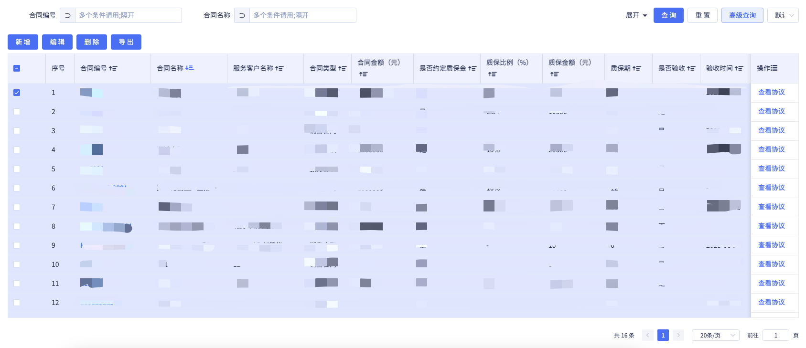

# BtTable2高亮异常/列排序后序号列异常

## 问题描述

## 产生原因
BtTable2组件`rowKey`属性默认值`id`。

接口返回数据中中的id不是唯一，导致了勾选一条数据后高亮异常。同时还会造成的问题是，如果存在序号列，对某一列进行排序后，序号列的序号混乱

## 解决步骤
1. 调整接口返回数据，保证id返回值唯一
2. 为BtTable2重新设置`rowKey`值