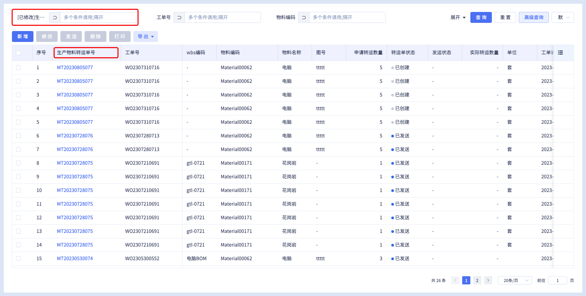

# BtTable修改列名不生效

## 问题描述


业务需求需要修改特定列名，按常规修改base中生成的列数据，如下：
```ts
// src/base/views/app/material-transport-page/components/base-material-transport-bt-table-context.ts
import { ComponentInternalInstance, reactive } from 'vue'
import { BtTableComponentContext } from 'beeboat-ui'
import BtCommon from 'beeboat-ui/es/common'
import { MaterialTransportItemApi } from '@/base/consts/api/mes/index'
import { UnitDescApi } from '@/base/consts/api/basic/index'
//MaterialTransportBtTable
export default class BaseMaterialTransportBtTableContext extends BtTableComponentContext {
    constructor(vueInstance?: ComponentInternalInstance) {
        // ................
        this.columnList = [
            {
                id: '18x1xF9vDSGzrpAyeN2ScN',
                label: '[已修改]生产物料转运单号',
                prop: 'transportNo',
                i18nKey: 'MaterialTransportPage.MaterialTransportBtTable.TransportNo',
                width: '200px',
                fixed: 'left',
                columnType: 3,
                searchProps: {
                    enable: true,
                    componentType: 'text',
                    supportConditionList: ['ne', 'like', 'eq', 'isNull', 'notlike', 'isNotNull'],
                },
            },
            // ................
        ]
    }

}

```
修改完成后，仅高级搜索的查询条件名称被修改成功，表格列名没有变化。

## 产生原因
BtTable2在生成代码的时候分为usage/base/locales等文件。

列名相关代码存在于base中的ts文件以及locales中的语言配置文件，如下：
```javascript
// src/base/locales/lang/app/material-transport-page/zh-CN.js
export default {
    MaterialTransportPage: {
        MaterialTransportBtTable: {
                column1676255746038 : '筛选',
                column1676255746037 : '序号',
                **TransportNo : '生产物料转运单号',**
                WorkOrderNo : '工单号',
                WorkTokenNo : 'WBS编码',
                WbsCode : 'wbs编码',
                MaterialNo : '物料编码',
                MaterialName : '物料名称',
                FigureNumber : '图号',
                TransportQty : '申请转运数量',
                TransportStatus : '转运单状态',
                ForwardStatus : '发运状态',
                ActualTransportQty : '实际转运数量',
                unit : '单位',
                PlanFinishTime : '工单计划完成日期',
                ActualForwardDate : '实际发运日期',
                BranchCompanyName : '所属组织',
                IfForward : '是否发运',
                CreatorName : '创建人',
                GmtCreate : '创建日期',
        },
    },
}

```
列名没有生效的主要原因在于，功能对应的语言文件zh-CN.js中没有对应修改。

## 解决步骤
1. 修改功能对应的base代码中生成的columnlist
2. 如果1不生效，检查生成的多语言文件zh-CN.js