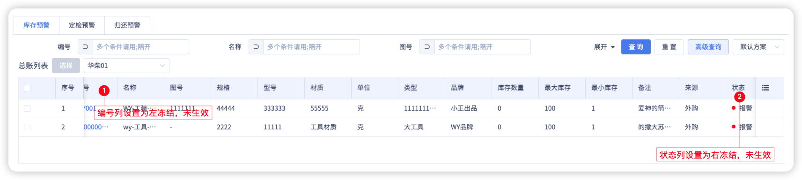
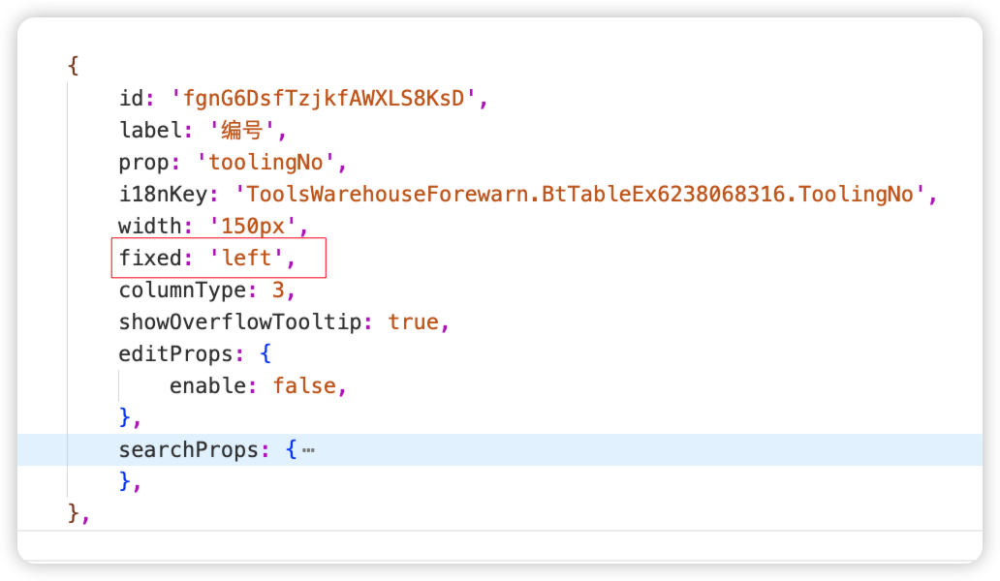
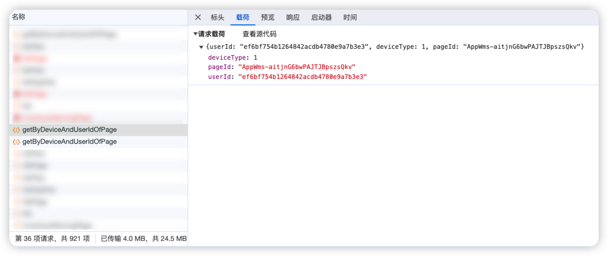

# 蜂舟平台表格列设置中设置了左/右冻结不生效
## 问题描述
设计页面时，拖拽了表格并进行了指定列的冻结位置，保存发布后，代码并没有生效。效果如图：

## 产生原因
功能开发过程中某一版本的时候，进行了高级搜索/列操作的保存操作。之后表格的渲染，高级搜索的方案均来自接口数据，如图：

接口返回列数据后，蜂舟生成的代码就不会生效了。

## 解决步骤
针对以上原因，目前有两种解决方案：
1. 通过修改tableId、senceId，修改后接口没有返回数据，就会优先使用本地代码。[重写方式参考](../../../技巧/beeboat/04重写组件事件.html)。
2. 后端开发同事去对应环境，删除对应账号的高级搜索/列操作数据