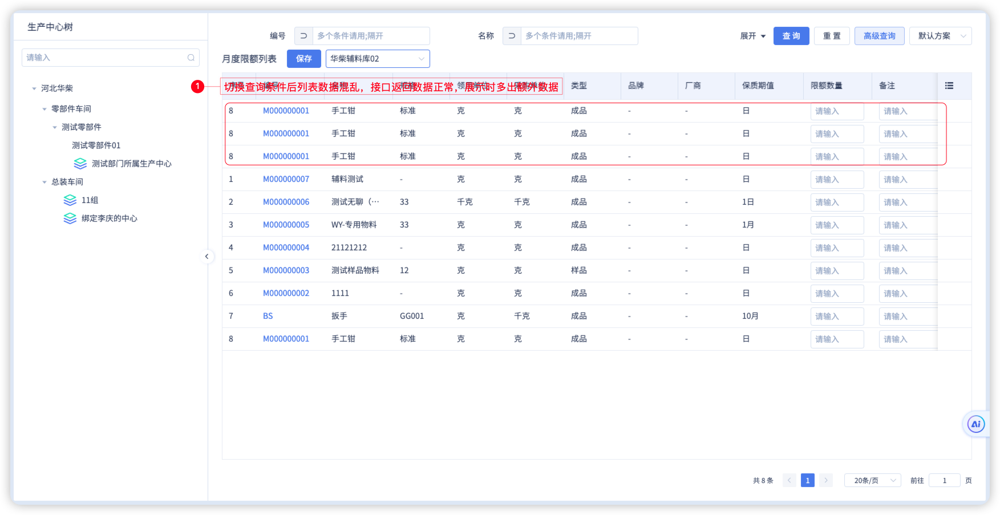
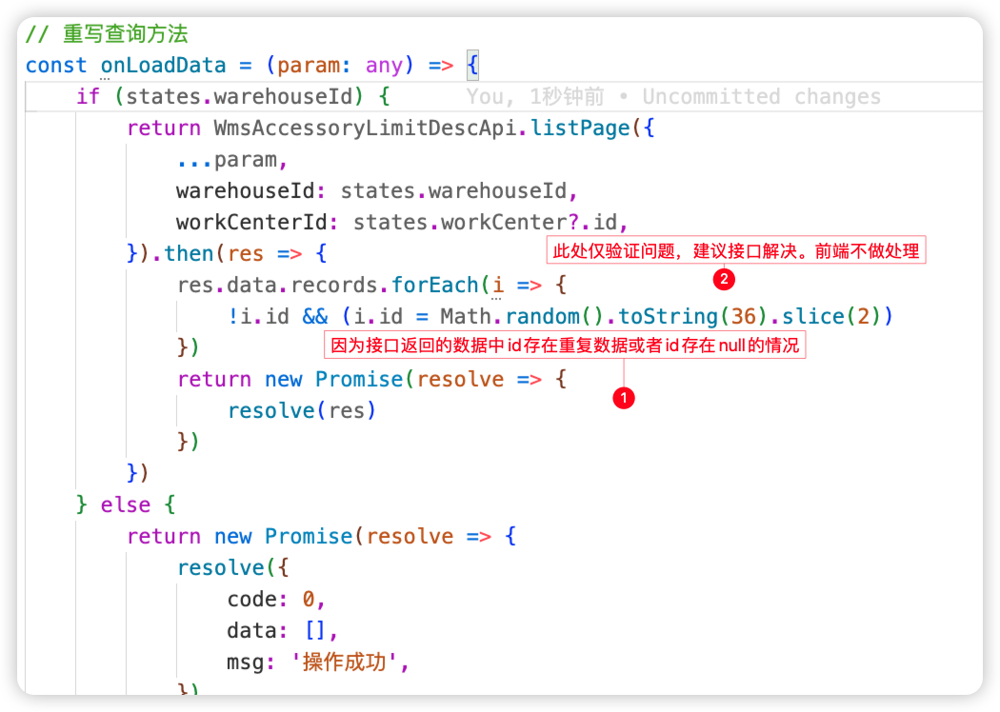

# 蜂舟平台表格展示的数据和接口返回不一致
## 问题描述
在页面切换查询后，列表展示的数据“莫名其妙”多了几条相同的数据，如图：

## 产生原因
接口返回数据有问题，表格的rowKey默认使用id，如果id存在为null或重复的情况就会造成[数据混乱/高亮异常](../../../bugs/beeboat/question/3.html)的现象

## 解决步骤

上图仅验证问题，并不是推荐的解决方案，当前问题的结局需要从接口层面解决。