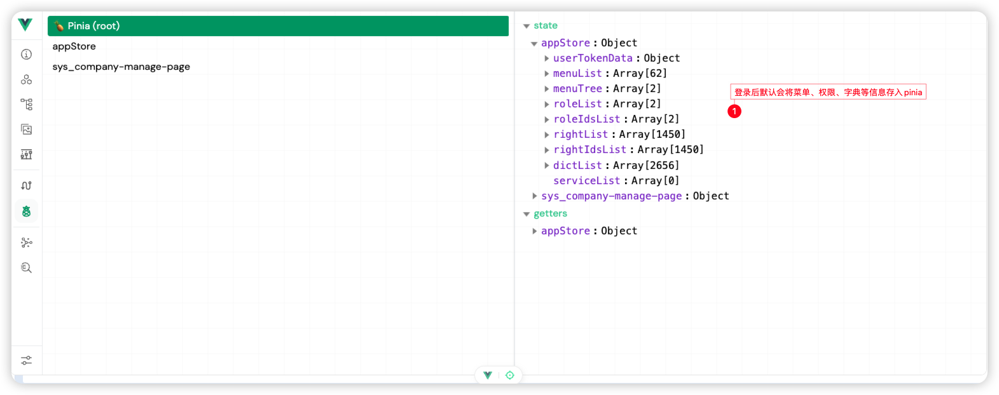
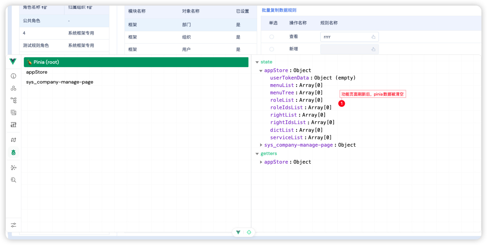

# 子应用刷新后pinia数据被清空
## 问题描述
在应用场景内，功能中用到获取pinia数据，刷新当前功能pinia被清空，如图：



## 产生原因
BeeboatUI实例化的对外提供自定义缓存的方法`mountedCustomCatchData`，如下：
```ts
export default class BtApplication {
    /**
     * 构造函数 先执行第一步init()
     * @param options 选项
     */
    constructor(options: IAppOptions) {
        this.init(options)
    }
    /**
     * 重写自定义缓存数据
     */
    async mountedCustomCatchData() {
        await this.loadCacheData()
    }
    /**
     * 方法要是同步请求，加载缓存数据，例如当前用户信息、部门信息、数据字典信息等
     */
    async loadCacheData(): Promise<any> {
        for (const item of this.pluginsHandlers) {
            if (item.isType('api')) {
                await item.handle()
            }
        }
        return new Promise(resolve => {
            resolve(true)
        })
    }
    // other....
}
```
在子应用开发过程中，自定义类并继承了BeeboatUI提供的`BtApplication`类，并重写了`mountedCustomCatchData`，重写的方法体存在问题，甚至并没有重写，只是吧方法列出来了，如下：
```ts
class UserApplication extends BtApplication {
    constructor(options) {
        super(options)
    }
    /** 重构 微服务加载方法 */
    initMicroApp(): void {
       // something
    }
    /**
     * 重写自定义缓存数据
     */
    async mountedCustomCatchData() {}
}
```
`BtApplication`被继承后，实例化`UserApplication`的时候就会进入重写的自定义缓存的方法，但又没处理缓存数据，导致pinia数据丢失
## 解决步骤
1. 如果有业务需求重写`mountedCustomCatchData`，那就按实际需求处理该方法
2. 如果仅仅是处理microapp初始化，那不必要的方法重写不要去写