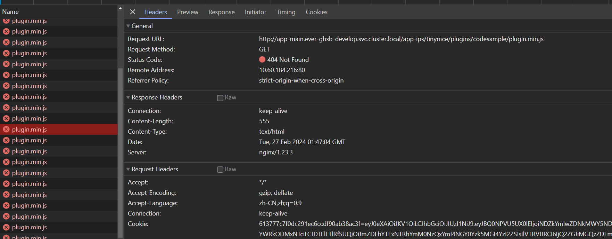
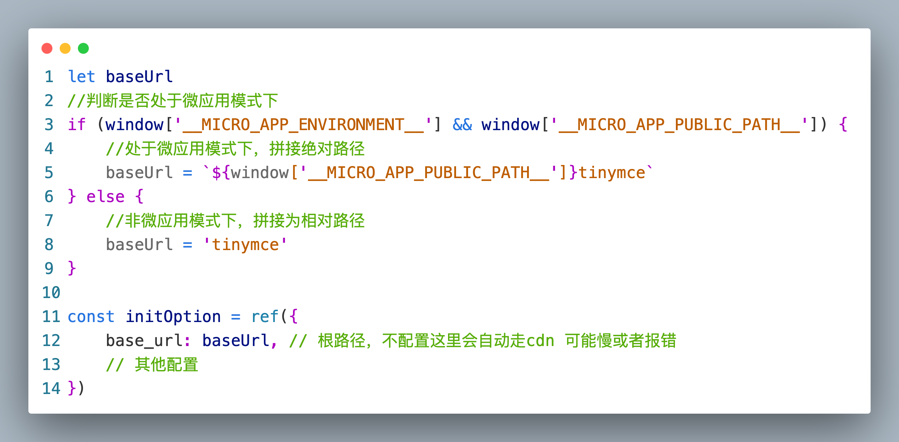

# tinymce富文本线上环境报错404
## 问题描述
单独启动子应用服务tinymce可以正常使用，通过基座菜单（microapp模式）资源请求报404错误。


## 产生原因
tinymce的BaseURL设置问题。默认tinymce的BaseURL是相对路径，根据浏览器地址拼接成完整路径导致404。

## 解决步骤
1. 判断运行环境，准备不同的baseUrl


```js
let baseUrl
//判断是否处于微应用模式下
if (window['__MICRO_APP_ENVIRONMENT__'] && window['__MICRO_APP_PUBLIC_PATH__']) {
    //处于微应用模式下，拼接绝对路径
    baseUrl = `${window['__MICRO_APP_PUBLIC_PATH__']}tinymce`
} else {
    //非微应用模式下，拼接为相对路径
    baseUrl = 'tinymce'
}
const initOption = ref({
    base_url: baseUrl
    // 其他配置
})
```