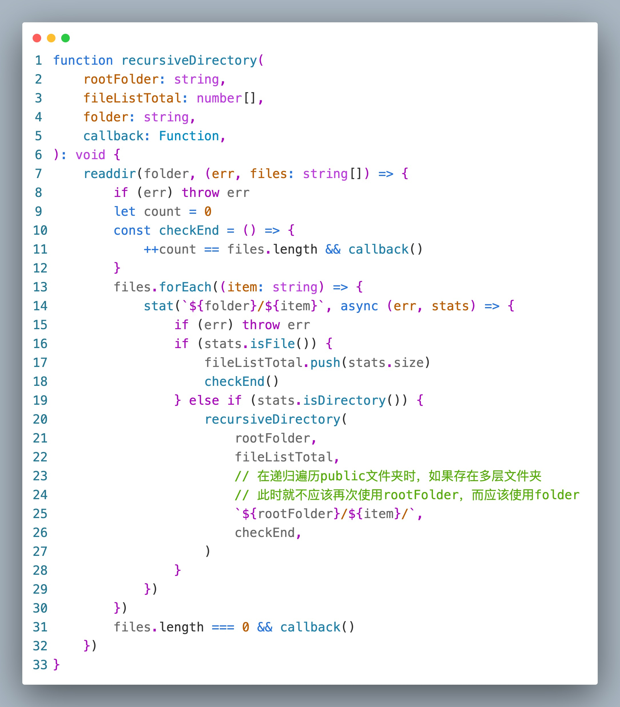

# Vite 打包项目时报错 ENOENT: no such file or directory, scandir 'dist/app-ips/langs/'

## 问题描述
```bash
/Users/Project/digital-factory-3-ips-web/vite.config.ts:207
      throw err;
      ^

[Error: ENOENT: no such file or directory, scandir 'dist/app-ips/langs/'] {
  errno: -2,
  code: 'ENOENT',
  syscall: 'scandir',
  path: 'dist/app-ips/langs/'
}
 ELIFECYCLE  Command failed with exit code 1.
```
## 产生原因
public文件夹内存在其他多层路径，如图：


同时`build/plugin.ts`打包构建插件中，对于文件夹的递归遍历的方法存在问题。如图：


## 解决方案
修改`build/plugin.ts`文件中的`recursiveDirectory`的递归方法，递归调用的时候不要传递根目录(rootFloder)，要传递上一层目录(floder)，代码如下：
```js
function recursiveDirectory(
    rootFolder: string,
    fileListTotal: number[],
    folder: string,
    callback: Function,
): void {
    readdir(folder, (err, files: string[]) => {
        if (err) throw err
        let count = 0
        const checkEnd = () => {
            ++count == files.length && callback()
        }
        files.forEach((item: string) => {
            stat(`${folder}/${item}`, async (err, stats) => {
                if (err) throw err
                if (stats.isFile()) {
                    fileListTotal.push(stats.size)
                    checkEnd()
                } else if (stats.isDirectory()) {
                    recursiveDirectory(
                        rootFolder,
                        fileListTotal,
                        `${folder}/${item}/`,
                        checkEnd,
                    )
                }
            })
        })
        files.length === 0 && callback()
    })
}
```