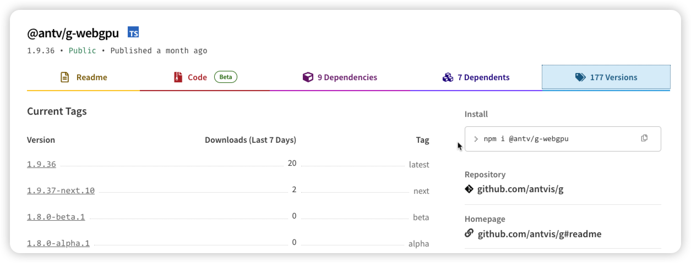

# [vite]: Rollup failed to resolve import xxxxx

## 问题描述
Jenkins构建vue3项目时报错，log如下：
```bash
[error] [31m[vite]: Rollup failed to resolve import "@babel/runtime/helpers/asyncToGenerator" from "node_modules/.pnpm/@antv+g-webgpu@0.7.2/node_modules/@antv/g-webgpu/es/Kernel.js".
This is most likely unintended because it can break your application at runtime.
If you do want to externalize this module explicitly add it to
`build.rollupOptions.external`[39m
[error] [31merror during build:
Error: [vite]: Rollup failed to resolve import "@babel/runtime/helpers/asyncToGenerator" from "node_modules/.pnpm/@antv+g-webgpu@0.7.2/node_modules/@antv/g-webgpu/es/Kernel.js".
This is most likely unintended because it can break your application at runtime.
If you do want to externalize this module explicitly add it to
`build.rollupOptions.external`
    at onRollupWarning (file:///data/jenkins/workspace/ever-digitalfactory-develop-app-ppm-e2392d6ad476d483127ce365e5b7bbcd/node_modules/.pnpm/vite@3.2.8_sass@1.70.0+terser@5.27.0/node_modules/vite/dist/node/chunks/dep-f11f7337.js:45909:19)
    at onwarn (file:///data/jenkins/workspace/ever-digitalfactory-develop-app-ppm-e2392d6ad476d483127ce365e5b7bbcd/node_modules/.pnpm/vite@3.2.8_sass@1.70.0+terser@5.27.0/node_modules/vite/dist/node/chunks/dep-f11f7337.js:45680:13)
    at Object.onwarn (file:///data/jenkins/workspace/ever-digitalfactory-develop-app-ppm-e2392d6ad476d483127ce365e5b7bbcd/node_modules/.pnpm/rollup@2.79.1/node_modules/rollup/dist/es/shared/rollup.js:23263:13)
    at ModuleLoader.handleResolveId (file:///data/jenkins/workspace/ever-digitalfactory-develop-app-ppm-e2392d6ad476d483127ce365e5b7bbcd/node_modules/.pnpm/rollup@2.79.1/node_modules/rollup/dist/es/shared/rollup.js:22158:26)
    at file:///data/jenkins/workspace/ever-digitalfactory-develop-app-ppm-e2392d6ad476d483127ce365e5b7bbcd/node_modules/.pnpm/rollup@2.79.1/node_modules/rollup/dist/es/shared/rollup.js:22119:26
    at async Promise.all (index 0)[39m
 ELIFECYCLE  Command failed with exit code 1.
Build step 'Execute shell' marked build as failure
Finished: FAILURE
```
## 产生原因
:::warning
当前解决方案可能不适用，会引起副作用，谨慎使用
:::
<!-- 项目引用直接依赖或深层依赖使用了CommonJs方式导致。

log中提示的`@antv/g-webgpu`没有在项目中直接引用，恰好时刚更新没多久的新包


Vite内部使用了Rollup进行构建打包，Rollup 默认只处理 ES6 模块，而更新后的`@antv/g-webgpu`可能使用了CommonJs方式。 -->
## 解决方案
<!-- 使用Rollup插件处理CommonJS方法的第三方依赖`@rollup/plugin-commonjs`,项目根目录新建`rollup.config.js`：
```js
import commonjs from '@rollup/plugin-commonjs'
export default {
    // ...其他配置
    plugins: [
        // ...其他插件
        commonjs(),
    ],
}
``` -->
```ts
export default ({ command, mode }: ConfigEnv): UserConfigExport => {
    const env = loadEnv(mode, root)
    return {
        // 其他配置
        build: {
            rollupOptions: {
                external: ['@antv/g6'],
            },
        },
    }
}

```