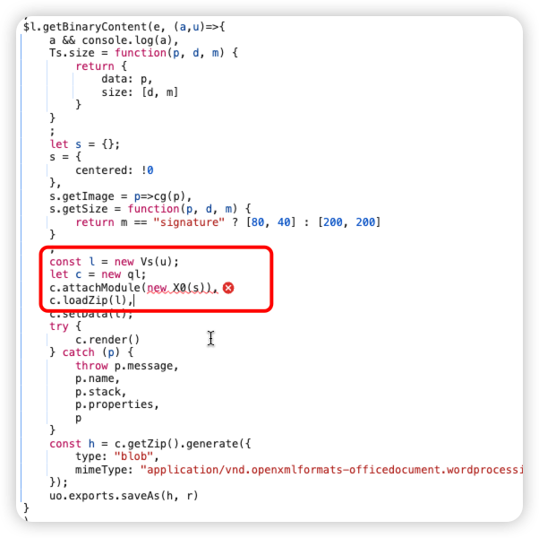
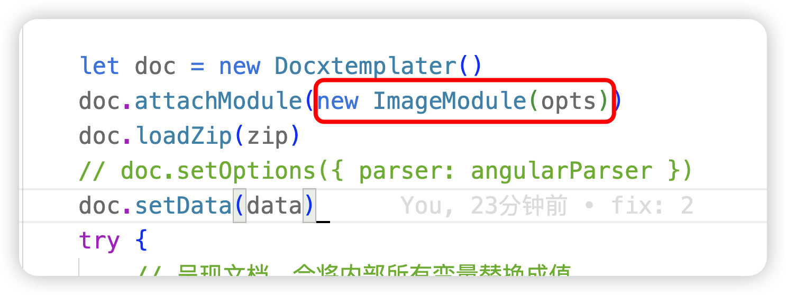
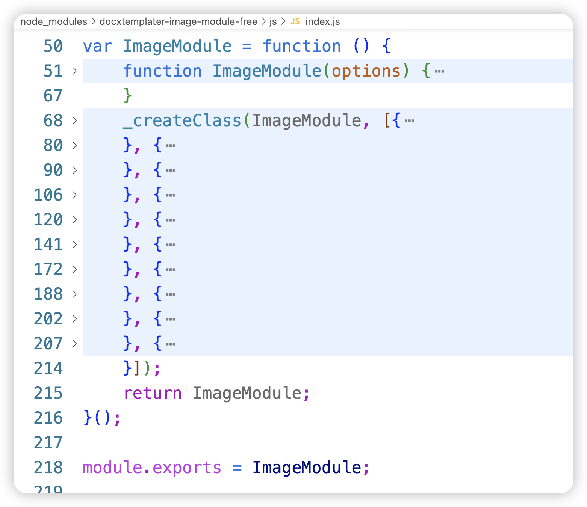

# 使用了CommonJS模块该如何处理

> 
> 
> TODO 关于技术选型
> 
> 在业务需要第三方库的时候需要进行技术选型，其中一点需要关注目标库的作者是否持续在更新迭代。
> 
> 如果长时间已经不更新了，需要注意了，库的格式可能不支持ESModule


## 问题描述

项目内需要前端实现Word导出，于是面向CSDN有了 [demo](https://blog.csdn.net/Coludidi/article/details/129730054)，demo中使用的第三方依赖其中一个是`docxtemplater-image-module-free`，本地开发一切正常，但是部署线上环境报错，导出功能报错。


***浏览器报错***

***线上环境浏览器解析后的代码***

***功能代码***

***依赖源码***


## 产生原因

通过对解析后的代码以及找到功能代码，可以看出`ImageModule`模块是由`docxtemplater-image-module-free`导出的。在`new ImageModule`的时候报错is not a constructor，说明依赖有问题

所以直接查看`docxtemplater-image-module-free`源码，通过源码可以看出当前这个依赖是CommonJS产物。当前项目构建方案使用Vite，所以问题在此，Vite是基于ESM的，无法直接处理CommonJS的

## 解决方案

### 方案1: 使用动态导入方案
```js
// import * as ImageModule from 'docxtemplater-image-module-free'
export const exportWord = (tempDocxPath, data, fileName, imgSize) => {
    // 动态导入
    import('docxtemplater-image-module-free')
        .then(({ default: ImageModule }) => {
            // 使用 ImageModule
            JSZipUtils.getBinaryContent(tempDocxPath, (error, content) => {
                // 其他代码
                let doc = new Docxtemplater()
                doc.attachModule(new ImageModule(opts)) // 
                doc.loadZip(zip)
                doc.setData(data)
                // 其他代码
            })
        })
        .catch(error => {
            console.error('Cannot load the module', error)
        })
}
```

### 方案2: 使用`@rollup/plugin-commonjs`

```bash
pnpm install @rollup/plugin-commonjs -D
```
```js
// vite.config.js
import commonjs from '@rollup/plugin-commonjs';

// https://vitejs.dev/config/
export default defineConfig({
    // 其他配置
    plugins: [commonjs()],
    // 其他配置
})
```

## 总结

不局限于当前场景，只要发现用到了CommonJS产物的依赖，都可以使用这两种方案。