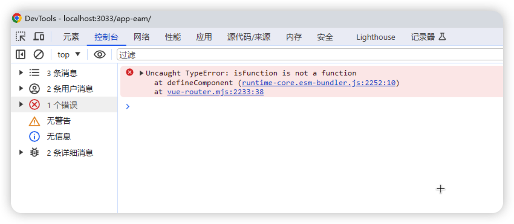

# Vue项目报错uncaught TypeError:isFunction is not a function
## 问题描述
在没有任何修改配置、安装依赖的前提下，突然报错`uncaught TypeError:isFunction is not a function`，如图

## 产生原因
原因未知??有可能是因为依赖版本出现问题

## 解决步骤
1. 删除lock文件
2. 删除node_modules
3. 重新执行pnpm i