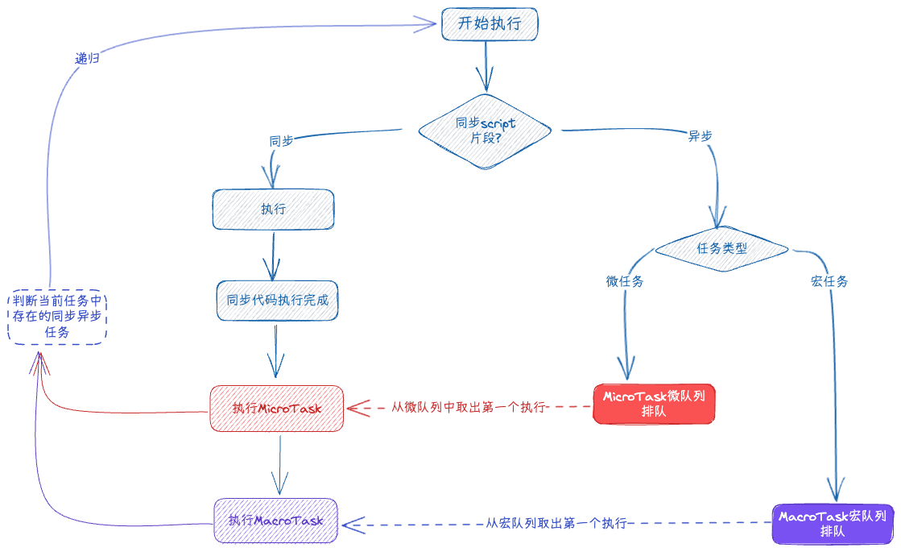

# JavaScript事件循环机制


> 换个说法：宏任务微任务是如何工作的？



1. **直接执行同步任务**
2. **执行时遇到微任务时放到微任务队列中，比如Promise.then/process.nextTick等**
3. **执行时遇到宏任务时放到宏任务队列中，比如setTimeout/setInterval等**
4. **执行完同步任务**
5. **从微任务队列中取出第一个任务执行，重复2/3/4，微任务队列执行完成**
6. **从宏任务队列中取出第一个任务执行，重复2/3/4，宏任务队列执行完成**
7. **直到宏任务队列和微任务队列中没有待执行的任务**

## 输出顺序
```js
console.log(1)
Promise.resolve().then(() => {
    console.log(2)
    setTimeout(() => {
        console.log(3)
    }, 0);
})
setTimeout(() => {
    console.log(4)
    Promise.resolve(5).then(() => {
        console.log(6)
    })
    console.log(7)
}, 0);
console.log(8)

// 1, 8, 2, 4, 7, 6, 3
```

## 过程解析
按照1-7执行依次拆解
```js
// 第一步
// 执行同步任务：输出1，8
// 此时微任务队列和宏任务队列已经存在任务
const microTaskQueue = [
    console.log(2)
    setTimeout(() => {
        console.log(3)
    }, 0);
]
const macroTaskQueue = [
    setTimeout(() => {
        console.log(4)
        Promise.resolve(5).then(() => {
            console.log(6)
        })
        console.log(7)
    }, 0);
]

// 第二步
// 取出微任务队列中的第一个任务执行，输出2
// 此时更新微任务队列和宏任务队列

// console.log(2)
// setTimeout(() => {
//     console.log(3)
// }, 0);

const microTaskQueue = []
const macroTaskQueue = [
    setTimeout(() => {
        console.log(4)
        Promise.resolve(5).then(() => {
            console.log(6)
        })
        console.log(7)
    }, 0),

    setTimeout(() => {
        console.log(3)
    }, 0);
]

// 第三步
// 微任务队列中已经没有待处理的任务，从宏任务队列中取出第一个任务执行，输出 4，7
// 此时更新微任务队列和宏任务队列

// setTimeout(() => {
//     console.log(4)
//     Promise.resolve(5).then(() => {
//         console.log(6)
//     })
//     console.log(7)
// }, 0),

const microTaskQueue = [
    Promise.resolve(5).then(() => {
        console.log(6)
    })
]
const macroTaskQueue = [
    setTimeout(() => {
        console.log(3)
    }, 0);
]

// 第四步
// 经过更新微任务队列中存在待执行任务，取出继续执行，输出 6
// 此时更新微任务队列和宏任务队列

const microTaskQueue = []
const macroTaskQueue = [
    setTimeout(() => {
        console.log(3)
    }, 0);
]

// 第五步
// 微任务队列没任务，从宏任务队列取任务执行，输出 3
// 此时更新微任务队列和宏任务队列
const microTaskQueue = []
const macroTaskQueue = []

// 至此，所有任务执行完成，所以输出顺序为：1,8,2,4,7,6,3
```