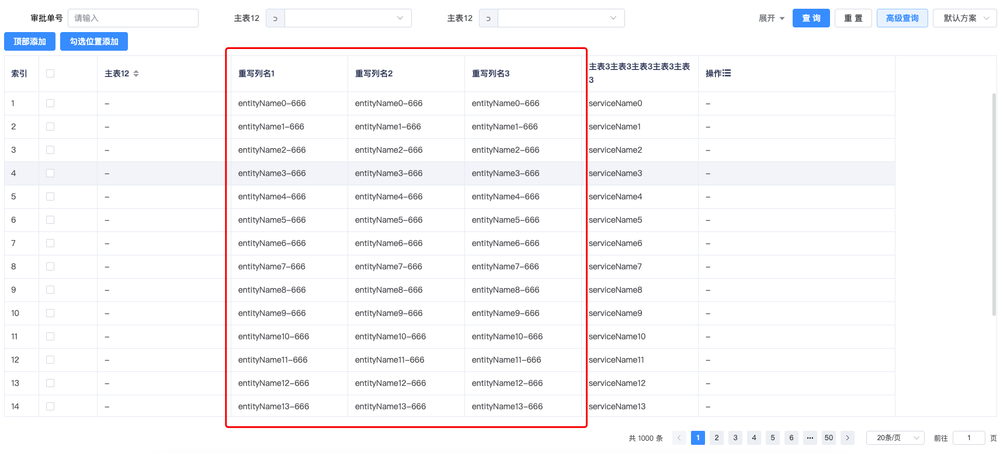

# 通过列重写实现动态列的需求

## 功能概述
目前BtTableEx组件暂时未提供动态列相关功能，但是可以通过重写列的方式实现。

需要在蜂舟平台表格设置的时候，为动态列设置一个占位列，后续重写该列实现动态列

## 相关代码
```html
<BtTableEx
    v-bind="tableConfig"
    ref="btTableEx"
    :columns="columnList"
    :request-api="dataApi"
    border
    :init-param="initParam"
>
    <!-- entityName是在蜂舟平台设置的占位列  -->
    <template #entityName="{ column }">
        <el-table-column v-bind="column" label="重写列名1">
            <template #default="{ row }">
                {{ row.entityName + '-666' }}
            </template>
        </el-table-column>
        <el-table-column v-bind="column" label="重写列名2">
            <template #default="{ row }">
                {{ row.entityName + '-666' }}
            </template>
        </el-table-column>
        <el-table-column v-bind="column" label="重写列名3">
            <template #default="{ row }">
                {{ row.entityName + '-666' }}
            </template>
        </el-table-column>
    </template>
</BtTableEx>
```
[BeeboatUI文档网站-BtTableEx相关文档](http://beet-docs.hive-df.com/docs/components/table-ex/)
## 实际效果


