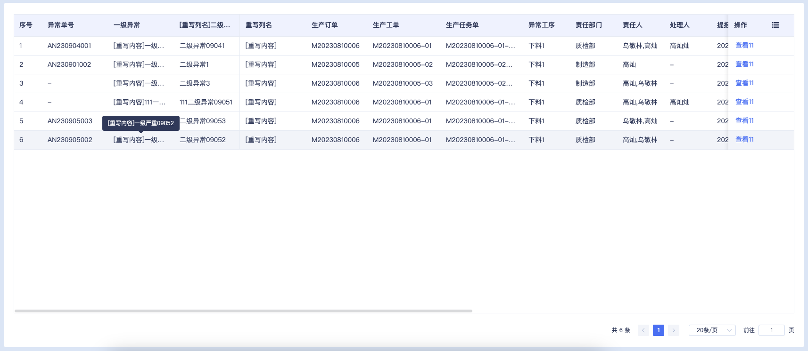

# 使用代码片段重写表格列的三种方式

## 功能概述
满足表格列重写需求，提供了一种全新的重写方式。该方式无需复制base中生成的全量表格代码，只需在base同级目录下创建components/[功能名]/index.fragment.html。将重写列的代码放在index.fragment.html内即可。


## 项目配置
```bash
pnpm install vite-plugin-beeboat-ui -D
```

build/plugin.ts增加配置，代码如下：
```ts
// 其他包导入
import BeeboatUIPlugin from 'vite-plugin-beeboat-ui'
// 其他方法
export function getPluginsList(command, env) {
    const lifecycle = process.env.npm_lifecycle_event
    return [
        BeeboatUIPlugin({})，// 配置
        // 其他插件
    ]
｝
```
***此处配置需要在蜂舟的配置文件中增加！！！！！！！！！***

## 相关代码
```html
<!-- components/bt-table-ex-abnormal-view/index.fragment.html -->

<!-- formatter: BtTableExColumn[columnName]Content -->
<template #BtTableExColumnfirstLevelAnomalyNameContent="scope">
    [重写内容]{{ scope.row.firstLevelAnomalyName }}
</template>
<!-- formatter: BtTableExColumn[columnName]Header -->
<template #BtTableExColumnsecondLevelAnomalyNameHeader="scope">
    [重写列名]{{scope.column.label}}
</template>
<template #eventDescription="{ column }">
    <!-- 保持elementplus的格式 -->
    <el-table-column v-bind="column" label="重写列名">
        <template #default="{ row, column }">
            [重写内容]
        </template>
    </el-table-column>
</template>

```
[BeeboatUI文档网站-BtTableEx相关文档](http://beet-docs.hive-df.com/docs/components/table-ex/)
## 实际效果


## 优势说明
1. 无需全量复制base生成的bt-table-ex
2. 功能对应的vue文件依旧保持生成的代码量
3. 代码结构清晰
