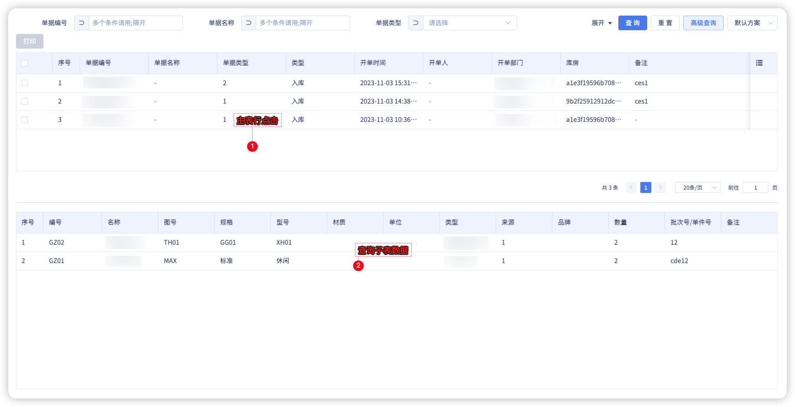

# 重写组件事件/属性

## 功能概述
蜂舟平台每一次迭代都会本着前端开发效率为第一目标，不需要开发人员copy全部代码进行重写。只需要根据业务需求增加相关没有生成的部分。即单独重写组件的事件/属性。

当前实例以表格(BtTableEx)的重写为例。

## 相关代码

```ts
// import packages
export default class ListLedgerContext extends BaseListLedgerContext {
    constructor(parentPageContext: any, vueInstance?: ComponentInternalInstance) {
        super(parentPageContext, vueInstance)
        // 重写表格的属性
        this.getBindProps('btTableEx6138924116').tableId = 'xxxxxxx'

        // 重写高级搜索条件下拉方法
        const columns = this.getBindProps('btTableEx6138924116').columns
        const WarehouseIdObj = columns.find(item => item.prop === 'warehouseId')
        WarehouseIdObj &&
            WmsNodeWarehouseApi.list({
                // params，根据业务需要传参
            }).then(res => {
                // 将结果重新使用promise抛出
                WarehouseIdObj.searchProps.dataSource = () => {
                    return new Promise(resolve => {
                        resolve(res)
                    })
                }
            })
        // 设置按钮的属性
        this.getBindProps('elButton4751276516', 'btTableEx6138924116').disabled = true
        // 设置表格的事件：选中事件
        this.getBindEvents('btTableEx6138924116').selectionChange = row => {
            this.state.selectArr = row
            this.getBindProps('elButton4751276516', 'btTableEx6138924116').disabled =
                this.state.selectArr && this.state.selectArr.length ? false : true
        }

        this.emits = emits
        // 设置表格的事件：行点击事件，同时抛出emits事件
        this.getBindEvents('btTableEx6138924116').rowClick = row => {
            // code
        }
    }
}

```

## 实际效果

