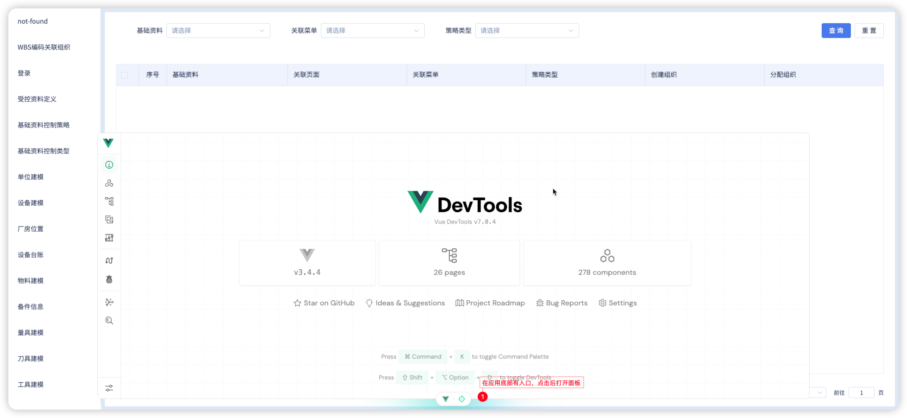
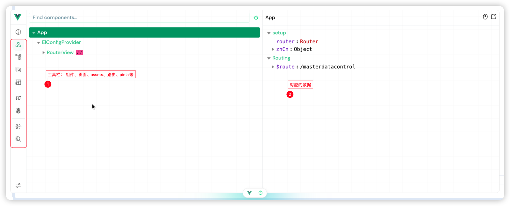

# 新一代Vue调试工具vite-plugin-vue-devtools

## 场景
排查交付部门反馈的项目问题时，发现浏览器插件版`Vue.js devtools`使用率太低(可能Chrome对应的插件下载需要魔法，所以不下了)。

不用插件的情况，排查问题，检查数据变化简直不能再难受了。开始推广新一代的Vue调试工具`vite-plugin-vue-devtools`，使用和浏览器插件一样。

## 安装配置
```bash
// 安装调试工具前，需要注意vite版本，需要大于3.1.0
pnpm install vite -D 
pnpm install vite-plugin-vue-devtools -D
```
```ts
// 配置插件
// vite.config.ts
import { defineConfig } from 'vite'
import VueDevTools from 'vite-plugin-vue-devtools'

export default defineConfig({
  plugins: [
    VueDevTools(),
    vue(),
  ],
})

```

## 使用



tips: 只在本地开发时会在页面加载，线上环境是不会加载的