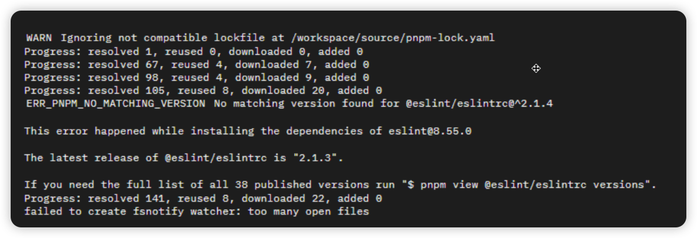
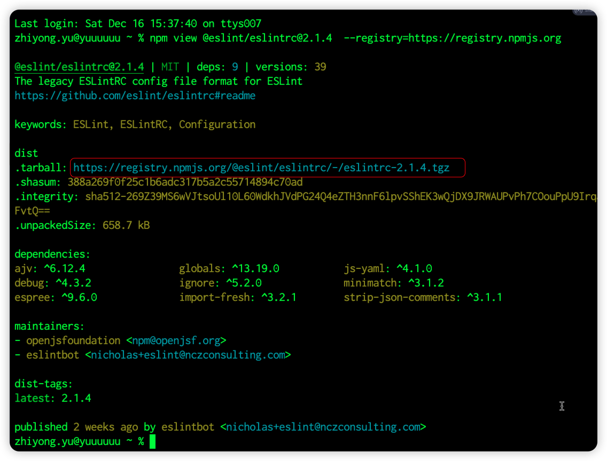
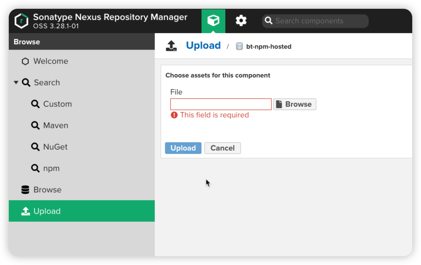

# Vue3项目安装依赖报错ERR_PNPM_NO_MATCHING_VERSION
## 问题描述

## 产生原因
引用的依赖被作者刚刚更新的时候，会存在一个时间差问题，导致`pnpm i`会报错

## 解决步骤
1. 执行`npm view @eslint/eslintrc@2.1.4  --registry=https://registry.npmjs.org`
2. 手动下载包，如图

   
3. 依赖包上传到私库，如图

