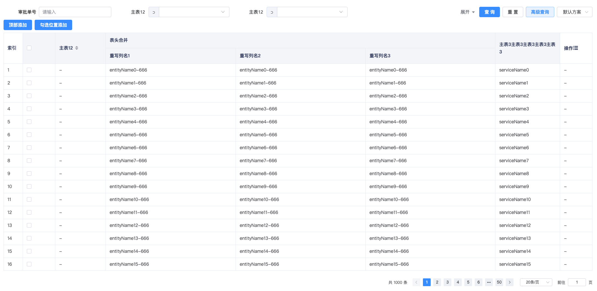

# 通过列重写实现合并列的需求

## 功能概述
目前BtTableEX组件没有提供列合并功能，但是可以通过列重写的形式实现表头合并的功能

## 相关代码
```html
<BtTableEx
    v-bind="tableConfig"
    ref="btTableEx"
    :columns="columnList"
    :request-api="dataApi"
    border
    :init-param="initParam"
>
    <template #BtTableExColumnentityNameHeader>表头合并</template>
    <template #BtTableExColumnentityNameContent="{ column }">
        <el-table-column v-bind="column" label="重写列名1">
            <template #default="{ row }">
                {{ row.entityName + '-666' }}
            </template>
        </el-table-column>
        <el-table-column v-bind="column" label="重写列名2">
            <template #default="{ row }">
                {{ row.entityName + '-666' }}
            </template>
        </el-table-column>
        <el-table-column v-bind="column" label="重写列名3">
            <template #default="{ row }">
                {{ row.entityName + '-666' }}
            </template>
        </el-table-column>
    </template>
</BtTableEx>
```
[BeeboatUI文档网站-BtTableEx相关文档](http://beet-docs.hive-df.com/docs/components/table-ex/)

## 实际效果

